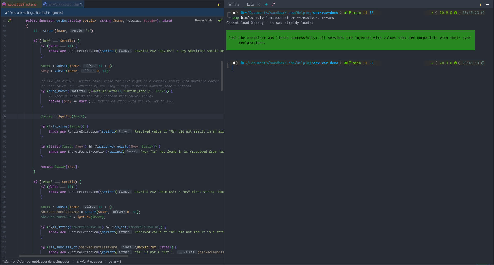
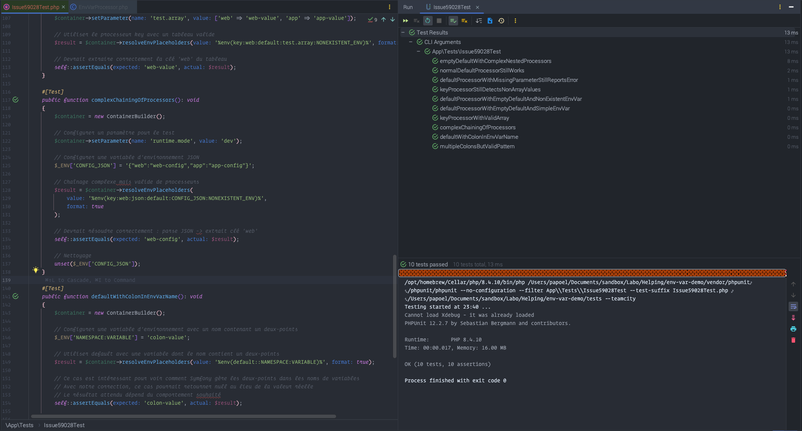

# Fix Symfony Bug #59028: Nested EnvVarProcessor Issue

## Problème

Ce projet démontre et corrige le bug [#59028](https://github.com/symfony/symfony/issues/59028) dans Symfony, où la commande `lint:container --resolve-env-vars` échoue lors du traitement d'expressions de variables d'environnement complexes, notamment avec des processeurs imbriqués.

## Solution

La correction implémente un traitement spécial dans <code>EnvVarProcessor.php</code> pour gérer correctement:

- Les valeurs par défaut vides (<code>default::</code>) suivies de chaînes complexes
- Les références au paramètre <code>container.runtime_mode</code> 
- Les cas où le processeur <code>key</code> reçoit des chaînes complexes

## Résultats

### Commande Lint Container

    <figure>
        
        <figcaption>La commande <code>php bin/console lint:container --resolve-env-vars</code> s'exécute maintenant avec succès</figcaption>
    </figure>

### Tests Unitaires 

    <figure>
        
        <figcaption>Les tests unitaires valident tous les cas d'utilisation</figcaption>
    </figure>

## Comment reproduire le problème

<ol class="steps">
    <li>Cloner ce dépôt</li>
    <li>Exécuter <code>composer install</code></li>
    <li>Sans la correction, exécuter <code>php bin/console lint:container --resolve-env-vars</code> génère l'erreur:</li>
</ol>

    Resolved value of "default:kernel.runtime_mode:" did not result in an array value.

## Comment vérifier la correction

<ol class="steps">
    <li>Avec la correction appliquée, exécuter <code>php bin/console lint:container --resolve-env-vars</code></li>
    <li>Le résultat devrait être:</li>
</ol>

    The container was linted successfully: all services are injected with values that are compatible with their type declarations.

<ol class="steps" start="3">
    <li>Exécuter les tests unitaires: <code>php bin/phpunit tests/Issue59028Test.php</code></li>
</ol>

## Détails techniques

La correction ciblée préserve le comportement normal de Symfony tout en gérant correctement les cas spéciaux qui causaient l'erreur, évitant ainsi les modifications de configuration dans les projets utilisateurs.

    <h3>Note sur cette contribution</h3>
    
Cette correction a été développée en partie grâce à l'assistance de Claude Sonnet (IA). Par respect pour les conventions et les développeurs de la core team Symfony, ce code est publié sur mon propre repository plutôt que d'être directement soumis au projet principal.

    
J'espère que cette solution sera utile à la communauté Symfony en attendant une correction officielle.

